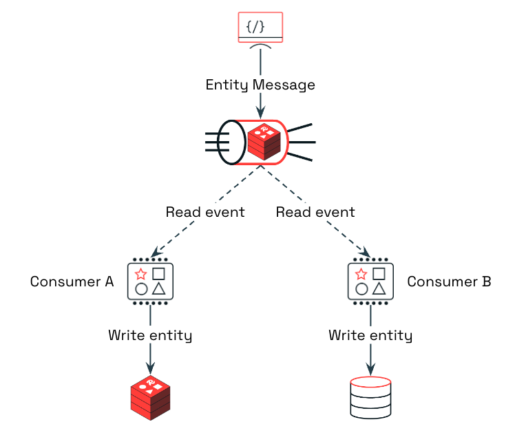
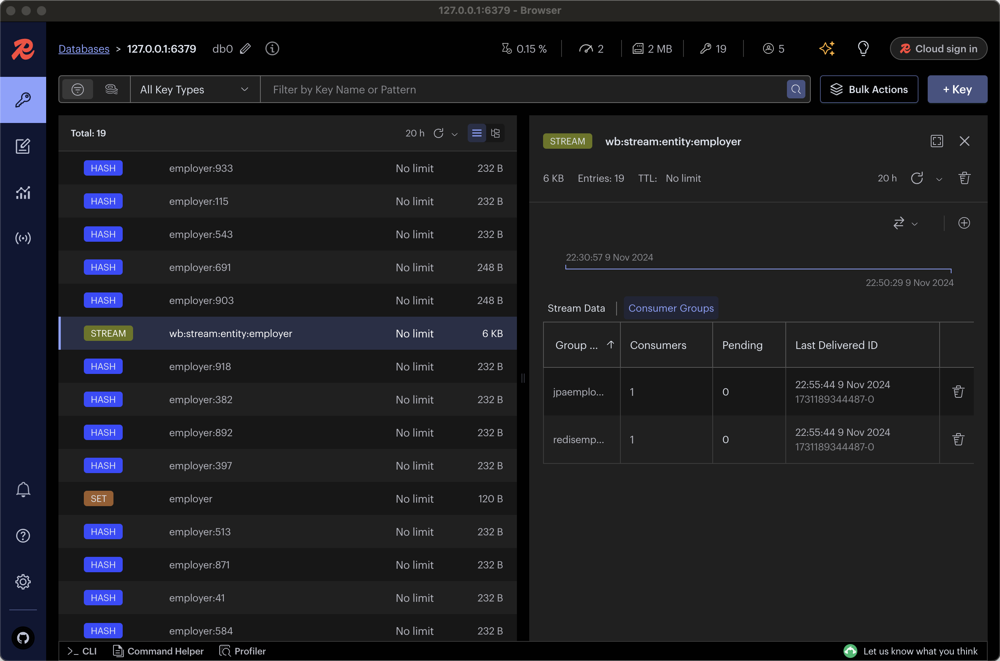

[](https://search.maven.org/artifact/io.github.foogaro/write-behind-streaming)

# Write-Behind-Streaming

The **Write Behind Streaming** library offers a powerful and efficient implementation of the write-behind caching pattern, specifically designed to support high-performance applications that require rapid data access and consistency across cache and database layers. By handling cache updates and synchronizing them with the underlying database in the background, this library ensures that data remains current and consistent without compromising application speed or responsiveness. This streamlined approach simplifies data management, making it ideal for applications with demanding performance and scalability requirements.

## Understanding the Write-Behind Caching Pattern

The write-behind caching pattern allows applications to update data directly in the cache and later propagate these updates to the underlying database. This approach keeps the data in the database consistent with the latest cached data, without delaying application performance due to direct database writes.

## Benefits of Writing Directly to Cache

Writing to the cache is significantly faster than writing to the database, improving application response times. Additionally, since reads are performed directly from the cache, data access is immediate, and your read operations remain consistent with the cached data.

## How the Write-Behind Mechanism Works

This library uses Redis Streams as a communication channel to connect the cache and underlying data storage seamlessly. When an entity is updated in the cache, an event or message is generated in Redis Streams. This message contains the entity’s data and is picked up by the respective repository, which then persists the update to the target data platform, such as SQL Server, PostgreSQL, or any other supported database.

Event consumption is managed by a built-in consumer, provided out-of-the-box by the library. For each repository, there is a dedicated consumer, allowing for parallel processing across multiple repositories. This design enables updates to be written to Redis, SQL Server, PostgreSQL, and other databases in near real-time, ensuring that data remains synchronized across all platforms.

This architecture allows for smooth and efficient data flow, where data is first cached for fast access, then reliably propagated to underlying databases with minimal delay, supporting consistency and high performance across your application’s data management layers.

The following high-level architecture illustrates how the flow works:

<p align="center"></p>

## Integrating the Library with Your Application

The library is built on the Spring Framework, leveraging the capabilities of Spring Data Redis to manage Redis operations efficiently. Specifically, it utilizes `RedisTemplate` for interacting with Redis data structures and `StreamMessageListenerContainer` for handling real-time event streaming. These components enable seamless integration with Redis, allowing the library to manage caching, data updates, and event processing in a reliable and scalable way.

## Getting Started with Write-Behind Caching

The write-behind-streaming library is built to be straightforward and user-friendly.

To get started, add the Maven dependency to your project by including the following in your `pom.xml` file:

```xml
<dependency>
    <groupId>io.github.foogaro</groupId>
    <artifactId>write-behind-streaming</artifactId>
    <version>0.2.0</version>
</dependency>
```

To enable the write-behind caching pattern in your application, simply apply the `@WriteBehind` annotation to the entities you wish to include. This annotation signals the library to handle these entities using the write-behind approach, allowing you to leverage the benefits of caching without additional configuration. Here’s an example of how to annotate your entities:

```java
@Entity
@Table(name = "employers")
@WriteBehind
public class Employer {

    @Id
    private Long id;

    @Column(name = "name", nullable = false)
    private String name;

    @Column(name = "address", nullable = false)
    private String address;

    @Column(name = "email", unique = true, nullable = false)
    private String email;

    @Column(name = "phone", nullable = true)
    private String phone;

    public Employer() {
    }

    public Employer(String name, String address, String email, String phone) {
        this.name = name;
        this.address = address;
        this.email = email;
        this.phone = phone;
    }

    // Getters and Setters

}
```

Once entities are annotated with `@WriteBehind`, the library automatically identifies them and generates the necessary logic to manage write-behind caching. This means that whenever data is updated in the cache, the library takes care of asynchronously propagating these changes to the underlying database, maintaining data consistency across both layers.

Writing to the Redis Stream is the initial step that triggers the entire write-behind caching process. When you want to update an entity across all systems, it must be sent as a message or event into the stream. This message will then be picked up to initiate the full synchronization flow.

To do this, implement a method similar to the following:

```java
public void saveEmployer(Employer employer) {
    try {
        String json = objectMapper.writeValueAsString(employer);
        Map<String, String> map = new HashMap<>();
        map.put(EVENT_CONTENT_KEY, json);
        MapRecord<String, String, String> record = StreamRecords.newRecord()
                .withId(RecordId.autoGenerate())
                .ofMap(map)
                .withStreamKey(getStreamKey());
        RecordId recordId = redisTemplate.opsForStream().add(record);
        logger.debug("RecordId {} added for ingestion to the Stream {}", recordId.getValue(), getStreamKey());
    } catch (JsonProcessingException e) {
        throw new RuntimeException(e);
    }
}
```

This method adds the entity payload, formatted as JSON, to a specified stream. You can see this implementation in action in the [demo application](https://github.com/foogaro/write-behind-streaming/blob/main/demo/jpa-employer/src/main/java/com/foogaro/redis/demo/service/redis/RedisEmployerService.java#L50) within this repository. When the Controller receives an HTTP POST request, it forwards the request and its payload to the Service, specifically to the saveEmployer method, which handles the process of writing to the Redis Stream, as depicted below:

<p align="center"></p>

With this setup, you gain the advantages of faster write operations directly to the cache, while the library seamlessly handles the synchronization of data to the database in the background. This approach ensures efficient, high-speed data access and consistency with minimal configuration, allowing developers to focus on application logic without worrying about complex caching management.

## Handling Errors and Ensuring Reliability

Redis Streams includes a Pending Entry List, which keeps track of all messages that have been processed but not yet acknowledged by consumers. 
The library periodically checks this list for any pending messages and reattempts to process them until they are either successfully acknowledged or reach the maximum number of allowed processing attempts. 

Additionally, if a message has been pending beyond a specified time threshold (acting as a timeout), it is flagged for special handling.

When either the maximum attempts are reached or the timeout occurs, the message is moved to a Dead Letter Queue (DLQ) stream. This DLQ serves as a holding area for messages requiring further attention, allowing for debugging and potential reprocessing. By using the DLQ, the library ensures that no data is lost, providing a safety net for handling unprocessed messages in a controlled and recoverable manner.

# Disclaimer

The Write-Behind-Streaming library is designed to facilitate efficient data caching and synchronization using the write-behind pattern. However, it is essential to carefully evaluate the suitability of this caching approach for your specific use case, especially in systems with stringent consistency requirements.

The library relies on Redis Streams for event processing and requires proper configuration of Redis and the underlying database to achieve optimal performance and reliability. While Write-Behind-Streaming includes mechanisms to handle errors and unprocessed messages, it does not guarantee absolute data recovery in cases of severe system failure or misconfiguration. Users are advised to implement additional backup, monitoring, and failover strategies to ensure comprehensive data protection.

By using Write-Behind-Streaming, you acknowledge that the library is provided “as-is” without warranties of any kind, and it is the user's responsibility to validate and monitor its integration within their specific application environment.